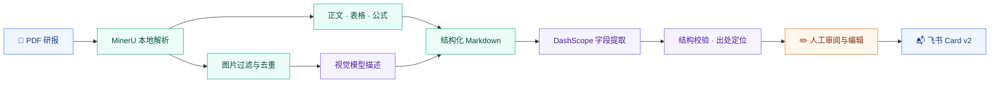

# 萃报 · Extract Flow

**券商研报解析、结构化提取与飞书推送工作台**

从一份 PDF 到一张可审阅、可编辑、可分享的研报卡片。


[核心能力](#核心能力) · [架构设计](#架构设计) · [结构化结果](#结构化结果) · [快速启动](#快速启动) · [开发与测试](#开发与测试)


---


## 项目简介

研报中的财务指标、业务拆分、盈利预测和风险提示分散在正文、表格与图表中，整理成摘要通常需要反复查找、核对和复制。

**萃报**将这套流程串联为一个 Web 工作台：上传 PDF 后，系统通过 MinerU 解析文档，结合视觉模型补充图像信息，再由 DashScope 提取结构化研报字段。用户对照解析后的原文审阅和修改结果，确认后发送至飞书群。

项目围绕 **文档理解、结果可追溯、人工审阅和任务管理**展开，提供 React 前端、FastAPI 后端及共用管线的 CLI 入口。

## 核心能力


| 能力              | 实现方式                                       |
| --------------- | ------------------------------------------ |
| 📄 **PDF 文档解析** | MinerU `pipeline` 后端解析正文、表格与公式，生成 Markdown |
| 🖼️ **图像信息补充**  | 图片去重与过滤，按上下文区分图表和普通图片，调用视觉模型生成描述           |
| 🧩 **结构化提取**    | JSON 模式输出，Pydantic 校验，JSON 解析失败时修复重试       |
| 🔎 **原文出处定位**   | 为字段记录原文摘录和 Markdown 位置，辅助审阅时回查依据           |
| ✏️ **人工确认**     | 工作台编辑字段、预览卡片并选择目标群，确认后发送                   |
| 📬 **飞书卡片推送**   | 构建 Card v2，记录发送结果及修改前后字段，发送失败可再次确认         |
| 📚 **批量任务管理**   | 单份 / 批量上传、进度轮询、历史搜索、状态筛选与原文件下载             |
| 📊 **提取用量统计**   | 记录字段提取的 Token、耗时、重试次数与估算费用                 |


## 架构设计




### 关键工程设计

- **管线复用**：CLI、API 与 Celery 执行路径复用 [app/pipeline.py](app/pipeline.py)，文档解析、提取与卡片构建保持统一编排。
- **业务与 HTTP 分离**：路由负责请求和响应映射，任务处理、群配置、确认发送等逻辑位于 `app/services/`。
- **解析进程隔离**：MinerU 在独立子进程中运行，设置超时和资源相关环境变量，由管线接收解析结果或错误。
- **结果与依据并存**：结构化字段之外保留原文出处和提取用量；出处指向解析后的 Markdown，便于与模型输入对照。
- **人工确认后发送**：模型生成结果先进入待确认状态，用户可修改字段；发送记录保留修改前后内容和成功 / 失败结果。
- **任务持久化与并发控制**：本地默认使用 SQLite，Compose 使用 Postgres；默认由进程内队列限制并发，另提供 Celery + Redis 执行路径。


### 任务生命周期

正常流程：

```text
queued → parsing → extracting → pending_confirm → sending → sent
 排队      解析中      提取中          待确认          发送中    已发送
```

处理或发送异常时进入 `failed`；保留提取结果的失败任务可再次确认发送。

### 本地处理与云端调用

MinerU 文档解析、图片哈希去重与过滤在本地完成；**图像描述和字段提取调用 DashScope 云端模型**。通过先解析、再过滤、最后提取，减少无关内容进入模型输入。

工作台中的 Token 与费用统计对应**字段提取阶段**，费用按配置单价估算，不代表包含图像描述在内的完整账单。

## 结构化结果

当前结果模型按业务语义组织为 **13 个顶层字段**，其中财务指标包含数值与变动，业务板块和盈利预测使用结构化数组。


| 信息类别  | 字段                                                               | 内容                        |
| ----- | ---------------------------------------------------------------- | ------------------------- |
| 基础信息  | `company_name` · `stock_code` · `report_period` · `rating`       | 公司、证券代码、报告期与评级            |
| 财务指标  | `revenue` · `net_profit` · `roe` · `total_assets` · `net_assets` | `value` 数值与 `change` 变动说明 |
| 业务板块  | `business_segments`                                              | 各板块名称、收入 / 规模与增速          |
| 盈利预测  | `profit_forecast`                                                | 按年份组织收入与净利润预测             |
| 观点与风险 | `core_view` · `risks`                                            | 核心观点与风险提示                 |


字段定义见 [ExtractionResult](app/extractor/schemas.py)。以下为**结构示例，数据为虚构**：

```json
{
  "company_name": "示例公司",
  "stock_code": "000000.SZ",
  "report_period": "2026Q1",
  "rating": "增持",
  "revenue": { "value": "100亿元", "change": "同比+10%" },
  "net_profit": { "value": "12亿元", "change": "同比+8%" },
  "roe": { "value": "6%", "change": "同比+0.2个百分点" },
  "total_assets": { "value": "500亿元", "change": "较年初+3%" },
  "net_assets": { "value": "200亿元", "change": "较年初+2%" },
  "business_segments": [
    { "name": "主营业务", "value": "80亿元", "growth": "同比+12%" }
  ],
  "profit_forecast": [
    { "year": "2026E", "revenue": "42000", "net_profit": "5000" }
  ],
  "core_view": "主营业务增长，盈利能力保持稳定。",
  "risks": "需求不及预期；行业竞争加剧"
}
```


## 工作台使用流程

1. **配置目标群**：在「飞书通知」中添加并保存机器人 Webhook。
2. **上传研报**：提交单份或多份 PDF，查看任务 / 批次进度。
3. **审阅结果**：对照清洗后的 Markdown 查看字段出处，修改提取内容并预览卡片。
4. **确认发送**：选择目标群，发送飞书卡片；在任务详情查看发送状态。

总览页展示任务统计、待审阅队列与 API 健康状态；历史任务支持搜索、状态筛选和原文件下载。

## 技术栈


| 层次    | 技术                                                              |
| ----- | --------------------------------------------------------------- |
| 文档与模型 | MinerU 3.x `pipeline` · DashScope OpenAI 兼容接口                   |
| 后端    | Python 3.10–3.12 · FastAPI · Pydantic v2 · uvicorn · SQLAlchemy |
| 前端    | React 19 · TypeScript · Vite · Tailwind CSS · Zustand           |
| 存储与任务 | SQLite / Postgres · 进程内任务队列 · 可选 Celery + Redis                 |
| 部署与通知 | Docker Compose · Nginx · 飞书 Card v2 Webhook                     |


## 快速启动

准备好 [Docker Desktop](https://www.docker.com/products/docker-desktop/) 和 DashScope API Key，在项目根目录执行：

```bash
git clone https://github.com/cwj-66/Extract-Flow-agent.git
cd Extract-Flow-agent
cp .env.example .env
```

在 `.env` 中填写 `DASHSCOPE_API_KEY`，然后启动服务：

```bash
docker compose up -d
```

首次启动会构建后端与前端镜像。Compose 编排 Postgres、Redis、API 与前端，并为后端注入数据库连接配置。


| 入口            | 地址                                                    |
| ------------- | ----------------------------------------------------- |
| 🖥️ Web 工作台   | [localhost:8080](http://localhost:8080)               |
| 📖 交互式 API 文档 | [localhost:8000/docs](http://localhost:8000/docs)     |
| 💚 健康检查       | [localhost:8000/health](http://localhost:8000/health) |


飞书 Webhook 通过工作台「飞书通知」配置并存入数据库。

**环境变量与常用命令**


| 变量                      | 默认值            | 说明                   |
| ----------------------- | -------------- | -------------------- |
| `DASHSCOPE_API_KEY`     | —              | 图像描述与字段提取所需的 API Key |
| `POSTGRES_USER`         | `extract`      | Compose 数据库用户名       |
| `POSTGRES_PASSWORD`     | `extract`      | Compose 数据库密码        |
| `POSTGRES_DB`           | `extract_flow` | Compose 数据库名称        |
| `PIPELINE_CONCURRENCY`  | `3`            | 默认队列的管线并发数           |
| `DECOMPOSER_ENABLED`    | `true`         | 是否启用图像内容分解           |
| `DECOMPOSER_BATCH_SIZE` | `5`            | 图像分解批大小              |


```bash
docker compose ps          # 查看服务状态
docker compose logs -f     # 查看日志
docker compose down        # 停止服务，保留数据卷
```


## 开发与测试


### 前端开发

先按快速启动步骤准备 `.env`，再启动数据库、Redis 与后端：

```bash
docker compose up -d postgres redis backend
cd frontend
npm install
npm run dev -- --host 127.0.0.1 --port 5173
```

访问 [127.0.0.1:5173](http://127.0.0.1:5173)，使用 Vite 热更新。Compose 中的前端位于 8080，提供构建后的静态页面。

**本机 Python API 与 CLI**

使用 Python 3.10–3.12，在项目根目录创建并激活虚拟环境，然后安装依赖：

```bash
pip install -r requirements-api.txt
pip install -e ./my_project
```

本机运行时需将 `DASHSCOPE_API_KEY` 设置为进程环境变量。例如 PowerShell：

```powershell
$env:DASHSCOPE_API_KEY = "your-api-key"
```

默认使用本地 SQLite。若已启动容器后端，先停止它以释放 8000 端口，再启动本机 API：

```bash
docker compose stop backend
uvicorn app.api.main:app --reload --host 127.0.0.1 --port 8000
```

前端开发服务在另一个终端运行。连接 Compose 的 Postgres 时，可参照 [.env.example](.env.example) 将 `DATABASE_URL` 设置为本机进程环境变量。

CLI 复用同一套解析与提取管线：

```bash
python main.py report.pdf -o output.md                 # 解析并保存 Markdown
python main.py report.pdf --extract -o card.json       # 提取并保存卡片 JSON
python main.py report.pdf --extract --extract-raw      # 同时输出结构化字段
python main.py report.pdf --stats                      # 查看文档解析统计
python main.py report.pdf --extract --send --webhook "https://open.feishu.cn/open-apis/bot/v2/hook/your-token"
```

CLI 发送通过 `--webhook` 指定目标，Web 工作台发送使用数据库中的群配置。


### 测试与评测

```bash
python -m pip install pytest
python -m pytest tests/ --ignore=tests/test_mineru.py
```

单元测试覆盖任务持久化、确认发送、结果元信息、原文出处定位与字段评测。字段评测工具见 [app/extractor/eval.py](app/extractor/eval.py)，支持精确匹配、数值容差与文本包含比较。

## 项目结构

```text
app/
├── api/              # FastAPI 路由、请求 / 响应模型与依赖
├── cleaners/         # MinerU PDF 解析与图像内容分解
├── extractor/        # 字段提取、出处定位、用量与评测
├── feishu/           # Card v2 构建与 Webhook 客户端
├── services/         # 任务、队列、存储与群配置业务
├── db/               # 数据库模型与连接
├── workers/          # Celery 任务执行入口
└── pipeline.py       # CLI / API / Celery 共用管线
frontend/             # React 工作台
my_project/           # MinerU 等管线依赖
tests/                # 单元测试
scripts/              # 模型准备与并发验证辅助脚本
```

**主要 API**


| 端点                                                                | 用途            |
| ----------------------------------------------------------------- | ------------- |
| `GET /health`                                                     | 健康检查          |
| `POST /upload` · `POST /upload/batch`                             | 单份 / 批量上传     |
| `GET /batches/{batch_id}`                                         | 批次进度          |
| `GET /tasks` · `GET /tasks/{task_id}`                             | 历史搜索、筛选与状态轮询  |
| `GET /tasks/{task_id}/content`                                    | 清洗后的 Markdown |
| `GET /tasks/{task_id}/result`                                     | 结构化提取结果       |
| `GET /tasks/{task_id}/file`                                       | 原始文件下载        |
| `POST /tasks/{task_id}/confirm`                                   | 修改字段并确认发送     |
| `GET /config/extraction-fields` · `PUT /config/extraction-fields` | 读取 / 保存字段模板配置 |
| `POST /config/extraction-fields/reset`                            | 重置字段模板        |
| `PUT /config/groups`                                              | 保存飞书群配置       |


启动 API 后，可在 [/docs](http://127.0.0.1:8000/docs) 查看完整请求与响应定义。


## 数据与开发约定

- 上传文件与运行数据位于 `data/`，Compose 通过目录挂载保留文件，Postgres 使用独立数据卷。
- `.env`、本地数据库、模型缓存、前端依赖与构建产物由 [.gitignore](.gitignore) 排除。
- 开发规范、服务分层与测试约定见 [AGENTS.md](AGENTS.md)；使用问题与建议可提交至 [Issues](https://github.com/cwj-66/Extract-Flow-agent/issues)。
